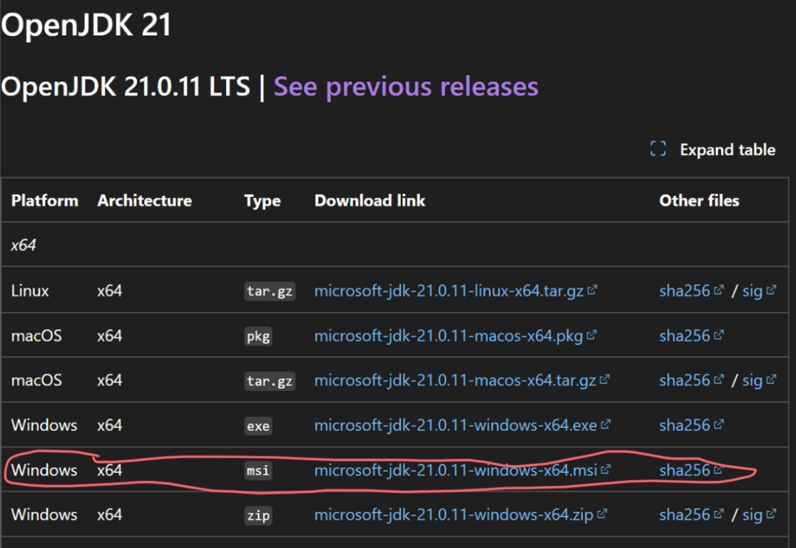
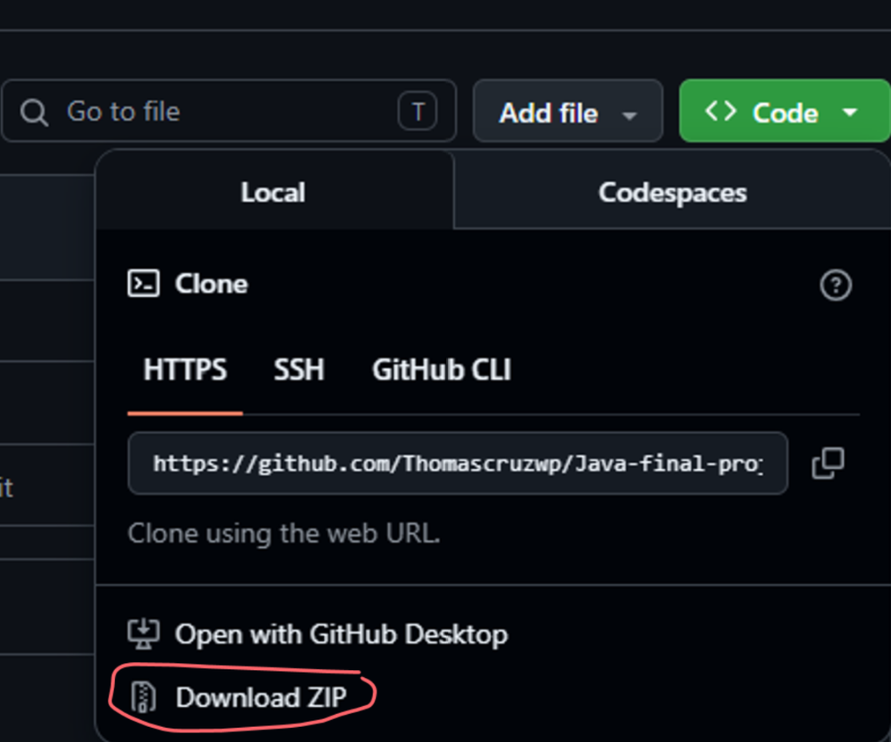
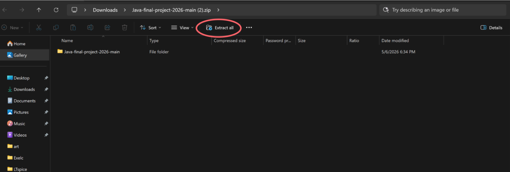
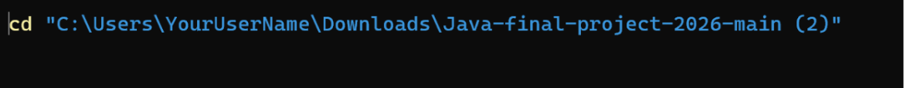
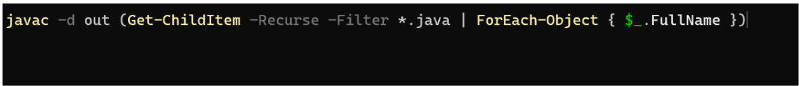
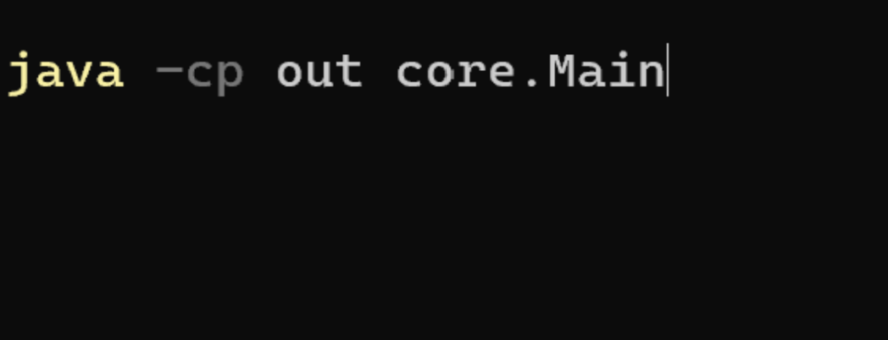
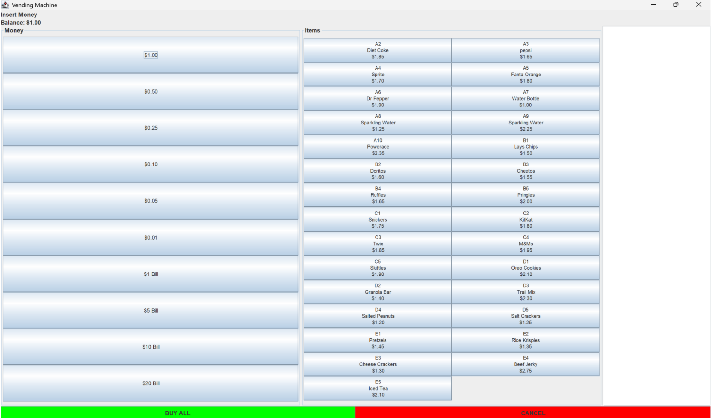

# Java-final-project-2026

## Prerequisites 
before running the application, you must have the Java Development kit (JDK) 21 installed on your system 

--- 
1. Vist the https://learn.microsoft.com/en-us/java/openjdk/download

2. Dowload the appropriate version for your OS: 
 * Windows: Windows x64 msi 

 * macOS (intel): macOS x64 pkg 

 * Linux: linux x64 tar.gz
    using the this command in linux terminal

 tar -xvzf microsoft-jdk-21.0.11-linux-x64.tar.gz 

  # Installation & Setup 

1. Download the project

* Go to the GitHub repository 

 * Click the green Code button and select Download ZIP 

* Locate the dowloaded folder, right-click and select Extract All 

Run all these commands in PowerShell in windows press the windows key and search up Powershell 

 2. Open PowerShell 
 Open PowerShell on your computer to begin the compilation process 

 3. run the following command (replace YouUserName with your acutal Windows username)

1. cd"C:\Users\Yourusername\Downloads\Java-final-project-2026-main"
 
 

This command finds all .java in the project and compiles them into an out folder 

2. javac -d out (Get-ChildItem -Recurse -Filter *.java | ForEach-Object { $_.FullName })  

# Finally run the code in Powershell 
3. java -cp out core.Main 

## App interface 
Once launched, you will see the Vending Machine GUI where you can: 

* Insert Money: Select denominations on the left

 * Select Items: Choose snacks/drinks from the grid on the right 

* Complete Transaction: Use the green BUY ALL button or the red CANCEL button 

